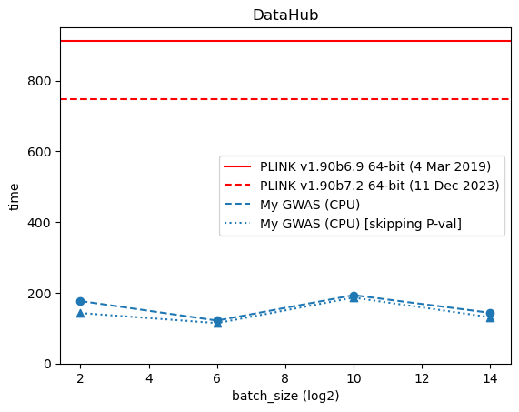
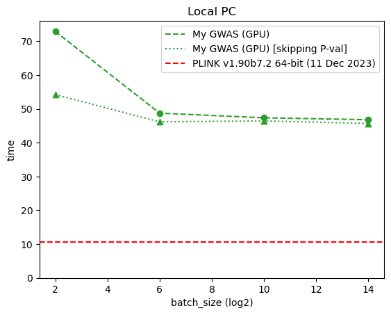
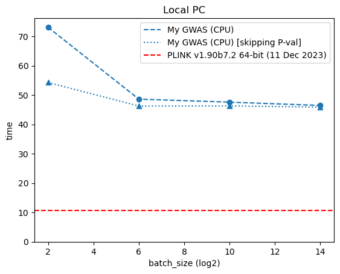

# Project: Accelerating GWAS with GPU Computing
Project Option: Option #1 - Implementation of GWAS and Application to Real Data
Team Members: Weixiao Zhan (A59023453)

### Description of Methods: 
In PS3, I observed significant computational delays when executing plink –linear for GWAS analysis on DataHub. My project intends to investigate the capacity of GPU computing to expedite GWAS computations. This will be achieved by utilizing Python in conjunction with libraries that are optimized for GPU operations. I used cyvcf2 for efficient VCF file parsing, PyTorch for in-memory data management, and PyTorch.GPU modules to leverage GPU acceleration capabilities. 
I will also compare the runtime performance across three different tools: 
* `PLINK v1.90b6.9 64-bit (4 Mar 2019)` (the default version on DataHub), 
* `PLINK v1.90b7.2 64-bit (11 Dec 2023)`(the plink 1.9 latest stable version),
* and my implementation:
    * CPU only
    * with GPU-acceleration

### Description of the Dataset: 
The performance is evaluated on the dataset provided in PS3, specifically `ps3_gwas.phen` and `ps3_gwas.vcf.gz`.
Meanwhile, [`data/example.phen`](data/example.phen) and [`data/example.vcf`](data/example.vcf) are extracted from the PS3 data set for demonstration.

# Usage

### install PyTorch dependency
For CPU version:
```
pip3 install torch --index-url https://download.pytorch.org/whl/cpu
```
For CUDA supported:
```
conda install pytorch pytorch-cuda=12.1 -c pytorch -c nvidia
```
### run example code
```
cd code
python3 main.py
```
### run plink
```
plink --linear \
--vcf data/example.vcf --pheno data/example.phen --allow-no-sex --maf 0.05 --out data/plink

```

# Results
### on DataHub
Since there is no GPU resources on DataHub, only CPU implementation is used. Following graph shows the runtime of three tools.



### on Local PC with GPU



#  Conclusion
1. The performance of `plink 1.9` varies greatly on different platforms. 
`plink 1.9` used some Intel specific acceleration library, 
which are not supported on DataHub's AMD chips. [^1]

[^1]: `pink 2.0`, currently still under development, promise to have versions specificity compiled and built for Intel and AMD, 
which should help speed up calculation on DataHub machines in the future.

2. The performance difference between my CPU and GPU implementation is negligible on my Local PC.
The GPU has better throughput, but higher latency and extra communication cost. 
In GWAS workload, only 3 matrix operation are loaded to GPU, 
which is not significant enough to counter the higher latency and extra communication cost.

3. There is no close formula for CDF of t-distribution; so using batch operation to compute p-value is preferred.
As shown in graph, as batch size increases, the time to compute p-values in my implementation (the difference between dash and dot line) is reduced.
However, bigger batch size may overwhelm system memory and 
cause the total computation to be slower 
(e.g. batch size = $2^{10}$ on DataHub). 